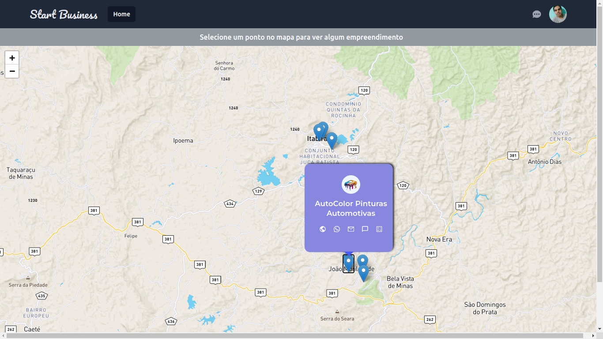
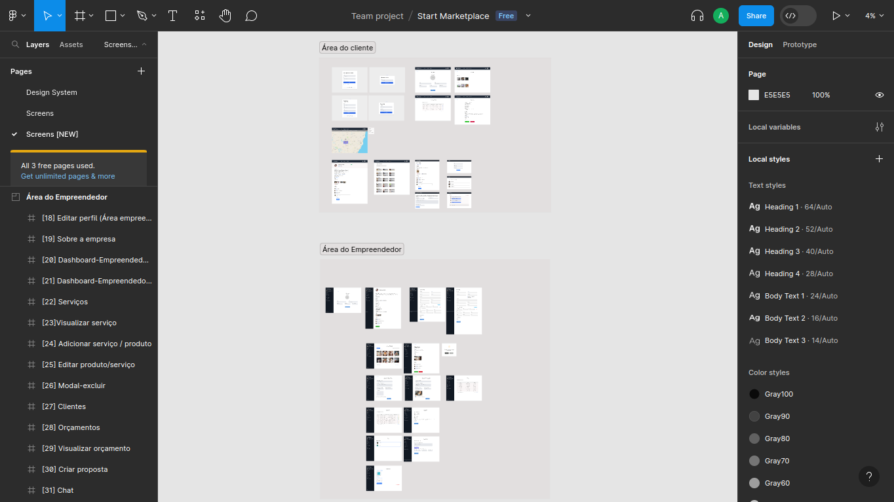

# Trabalho de conclusão de curso (TCC)
Projeto desenvolvido para o trabalho de conclusão de curso (TCC) de Sistemas de Informação - UFOP.

<div>
 
  
</div>
<br>


<b> <br> Índice </b>
<div>
<ul>
<li><a href="#-sobre-o-projeto">Sobre o projeto</a></li>
<li><a href="#-tecnologias-utilizadas">Tecnologias utilizadas</a></li>
<li><a href="#-layout-da-aplicação">Layout</a></li>
<li><a href="#-como-executar-a-aplicação">Como executar a aplicação</a></li>
<li><a href="#-deploy-da-aplicação">Deploy da aplicação</a></li>
<li><a href="#-como-contribuir">Como contribuir</a></li>
<li><a href="#-licença">Licença</a></li>
<li><a href="#-autor">Autor</a></li>
</ul>
<div>


## 📄 Sobre o projeto

O projeto desenvolvido tem o objetivo de auxiliar os microempreendedores individuais (MEIs), por meio de um sistema que permite divulgar os seu negócio e serviços, aproximando do seu público-alvo e aumentando o seu alcance.

## 🧑‍💻 Tecnologias utilizadas

Para a implementação do front-end, foi utilizada como linguagem de programação o TypeScript, junto com a biblioteca do React.js e alguns frameworks, listados abaixo:

<a href="https://developer.mozilla.org/pt-BR/docs/Learn/HTML">
</a>
<a href="https://developer.mozilla.org/pt-BR/docs/Learn/CSS"></a>
<a href="https://react.dev/"></a>
<a href="https://tailwindcss.com/"></a>
<a href="https://vitejs.dev/">

</a>
<a href="https://sass-lang.com/">

</a>

## 🎨 Layout da aplicação



Você pode visualizar o layout da aplicação pelo link abaixo:

<a href="https://www.figma.com/file/TTGQPpAVEUs8ZEKbFAPYlb/Start-Marketplace?type=design&node-id=1101%3A1069&mode=design&t=OH2RvYnQHQs8IxSO-1">Layout</a>

Para acessar o layout você precisará ter acesso ao figma. Para criar uma conta acesse o link:

<a href="https://www.figma.com/login">
    Criar conta no Figma
</a>


## 🚀 Como executar a aplicação
Antes de executar a aplicação certifique que você tenha instalada uma versão LTS do Node e npm.

Para executar a aplicação deve seguir os seguintes passos:

<ol>
  <li>Clone o repositório:
  <code>https://github.com/andersondev96/tcc-frontend</code>
  <li>Abra o terminal e acesse a pasta <code>tcc-frontend</code> com o comando: <code>cd tcc-frontend</code>
  <li>Instale as dependências do projeto:<br>
  <code>npm install</code> ou <code>yarn install</code>
  <li>Configure as variáveis ambiente:

<br>

  ```
    VITE_APP_ENV=local
    VITE_API_LOCAL='http://localhost:3333'
    VITE_ACCESS_TOKEN_MAP_BOX=your-vite-access-token-map-box
    VITE_GOOGLE_MAPS_API_KEY=your-vite-google-maps-api-key

  ```

  </li>
  <li>Com tudo configurado você poderá acessar a aplicação com o comando<br>
  <code>npm run dev</code></li>
<li>A aplicação será executada na porte <code>3000</code> do servidor. Para acessar a interface abra um navegador de sua preferência e acesse essa url: 

<code>http://localhost:3000</code>

Lembrando que para que a aplicação esteja funcionando corretamente, o servidor node deve estar sendo executado, para isso é necessário clonar a aplicação node e seguir todas as instruções para a sua configuração. A aplicação node está no seguinte repositório: 
<a href="https://github.com/andersondev96/tcc-api/">
Servidor Node
</a>

</ol>

## ⚙ Deploy da aplicação
A aplicação está disponível online no seguinte endereço:
<a href="https://app.startbusinesshome.dev/">
https://app.startbusinesshome.dev/
</a>

O deploy da aplicação foi feito utilizando o <a href="https://netlify.com/">Netlify</a>.

## 🤝 Como contribuir
<ol>
<li>
  Faça um fork do repositório.
  Crie uma nova branch com as suas alterações:
  
  <code>git checkout -b my-feature</code>
  </li>

<li>Salve as suas alterações e crie uma mensagem de commit, dizendo o que você fez: 
  
  <code>git commit -m "feature: My new feature"</code>
</li>

<li>
Envie as suas alterações: 
  
  <code>git push origin my-feature</code>
</li>
</ol>

## 📝 Licença
 <p>Este projeto está sobre a licença <a href="LICENSE">MIT</a>.

## 👥 Autor

<div style="display:flex; flex-direction:column; align-items: center;">
  <a href="https://www.linkedin.com/in/anderson-fernandes96/">
    <div style="display: flex; flex-direction: column; align-items: center; gap: 10px">
    
    <strong>Anderson Fernandes Ferreira</strong>
    </div><br>
    <div style="display:flex; flex-direction:row;gap:8px;">
  <a href="https://instagram.com/anderson_ff13" target="_blank"></a>
  <a href = "mailto:andersonfferreira96@gmail.com.br"></a> 
  <a href="https://www.linkedin.com/in/anderson-fernandes96/" target="_blank"></a> 
  </div>
</div>

</a>
<br>
<p style="text-align: center;">
  Feito com 💚 por Anderson Fernandes 👋 
  <a href="https://www.linkedin.com/in/anderson-fernandes96/">Entre em contato!</a>
  <br>
</p>
